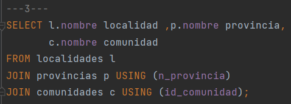
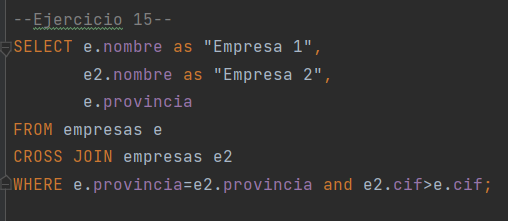
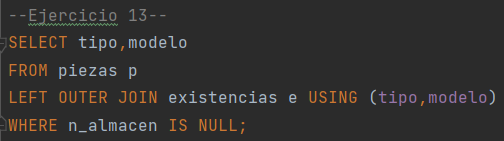
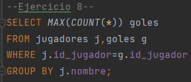
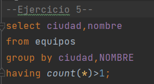

# port-folioGBD-marzo
# Porfolio de GBD segundo trimestre

## **Resumen**

En este trimestre hemos visto las diferentes consultas que se pueden hacer, como por ejemplo,
hemos echo consultas basicas en donde sacamos nombres, números y diferentes cosas aunque 
utilizando solo una tabla.
Más adelante hemos ido viendo que se pueden hacer consultas de varias tablas a la vez, es 
decir utilizando los datos de varias tablas para sacar la información/consulta que necesitemos.
Por último hemos visto las consultas totales, que operan con los datos de la misma fila, pero 
tambien pueden utilizarse para hacer calculos de diferentes filas.

## **Reflexión personal**

Estos temas la verdad que me han parecido interesantes, aunque al no haberlo pillado bien me 
ha resultado muy dificil realizar cada consulta, en mi opinion tengo que practicar bastante más
e ir comprendiendo punto por punto que hace cada parametro y cada consulta.
Tengo que decir que aunque estos temas me han resultado complicados las consultas que tenian niveles 
como 4,5 y 6 más o menos si que las iba sacando aunque me costasen bastante.

## **Ejercicios significativos**

* Consultas de varias tablas usando algún tipo de JOIN con ON y/o USING
  * Es el Ejercicio 3 de geografia
  

* Consultas que usen CROSS JOIN
  * Es el Ejercicio 15 de almacen
  

* Consultas que usen LEFT OUTER JOIN
  * Es el Ejercicio 13 de almacen
  

* Consultas que usen SUM, AVG, COUNT, MAX o MIN

    * Es el Ejercicio 8 de futbol
  

* Consultas que usen HAVING

  * Es el Ejercicio 5 de NBA

## **Ejercicios de invención**

* Ejercicio 1

* Ejercicio 2

## **Conclusión**
Pues las dificultades que he tenido ha sido a la hora de entender las consultas dentro de otras consultas,
aunque las consultas simples las he entendido más o menos y me iban saliendo, cosa que las dificiles no me
salían y no las entendía bien, por último las consultas totales alguna si que me ha salido y las entiendo 
aunque cuando tenemos varios parametros de calculo me ha costado entenderlo.